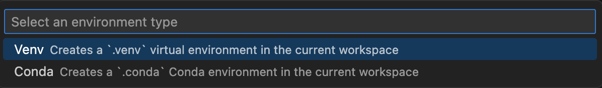

# Python simulations

## Overview

This repo contains the simulations of different market scenarios (e.g. price spikes, new listings, whale activities, etc.) in order to gain information about the agent response.

## Settings

- **Model:** gpt-4o
- **System prompt:** "You are a helpful trading assistant that suggest the best operations on the market. You should always return a trading signal that you consider the best when the user asks."
- **User input:** "What trade should I do today?"

## How to run the project locally

1- Clone the repository

```
git clone https://github.com/gorilli-team/python-simulations.git
```

2- Create a virtual environment (venv)

- Open the command palette (CMD + MAIUSC + P) and select **"Python: Create Environment..."**
<div style="display: flex; justify-content:center">
</img>
</div><br>

- Select **"Venv"**
<div style="display: flex; justify-content:center">
</img>
</div><br>

- Select the **Python interpreter** (recommended: the most recent one)
<div style="display: flex; justify-content:center">
</img>
</div><br>

- Select the **requirements.txt** to install the dependencies, and click "OK".
<div style="display: flex; justify-content:center">
</img>
</div><br>

- Check if the **".venv"** folder has been created.
<div style="display: flex; justify-content:center">
</img>
</div><br>

3- Activate the virtual environment

```
source .venv/bin/activate
```

Tip: you should see a (.venv) at the beginning of the CLI in your terminal.

4- Clone the .env.example file and add the OpenAI API Key

```
cp .env.example .env
```

5- Test different scenarios by modifying the selected json file in the `search_db` function inside `retrieval-events-gpt.py`.

```
def search_kb(question: str):
    """
    Loads all the available events from the JSON file.
    """
@>  with open("./events/new-listing.json", "r") as f:
        return json.load(f)
```

6- Run the script

```
python retrieval-events-gpt.py
```

## Scenarios

All the scenarios tested as of the date of writing (21/03/2025) are listed in the following diagrams.<br>
**NOTICE:** the simulations have been conducted ONLY with the `retrieval-events-gpt.py` script. Further tests with the newly created `prompt-chaining-and-parallelization.py` script are still to be published.

<div style="display: flex; justify-content:center">
</img>
</div><br>
<div style="display: flex; justify-content:center">
</img>
</div><br>
<div style="display: flex; justify-content:center">
</img>
</div><br>
